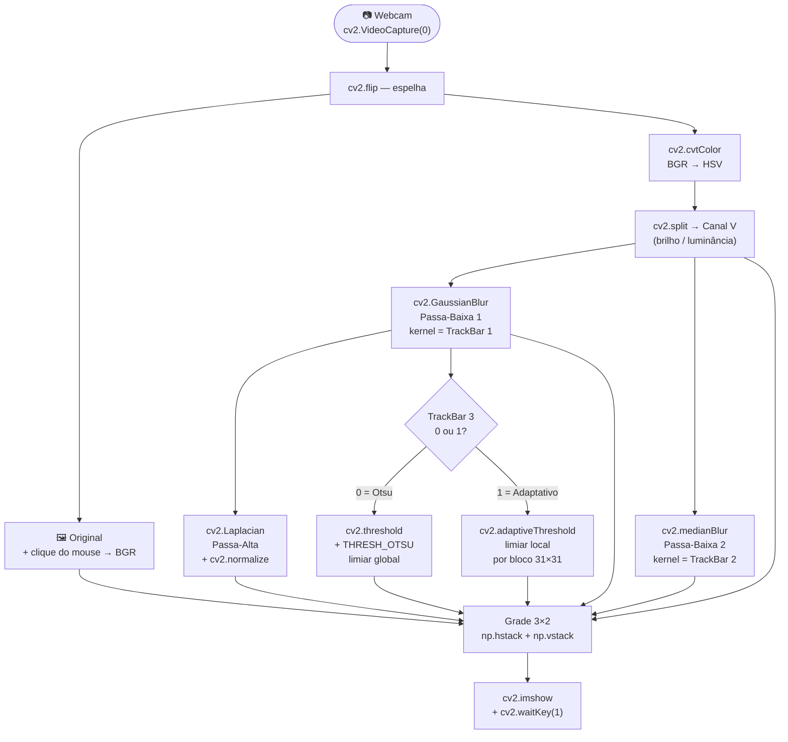

# 🎥 Pipeline de Filtros em Tempo Real — Webcam

> **Script:** `pipeline_filtros.py`  
> **Disciplina:** Visão Computacional — HighGUI  
> **Bibliotecas:** OpenCV (`cv2`), NumPy

---

## 📋 Índice

1. [O que é um Pipeline de Visão Computacional?](#-o-que-é-um-pipeline-de-visão-computacional)
2. [Como Executar](#-como-executar)
3. [Interface da Janela](#-interface-da-janela)
4. [Etapas do Pipeline](#-etapas-do-pipeline)
   - [Etapa 1 — Captura e Leitura de Cor](#etapa-1--captura-e-leitura-de-cor-clique-do-mouse)
   - [Etapa 2 — Conversão HSV e Canal V](#etapa-2--conversão-hsv-e-extração-do-canal-v)
   - [Etapa 3 — Passa-Baixa 1: Gaussiano](#etapa-3--filtro-passa-baixa-1-gaussianblur)
   - [Etapa 4 — Passa-Baixa 2: Mediana](#etapa-4--filtro-passa-baixa-2-medianblur)
   - [Etapa 5 — Passa-Alta: Laplaciano](#etapa-5--filtro-passa-alta-laplaciano)
   - [Etapa 6 — Binarização](#etapa-6--binarização-otsu-vs-adaptativo)
5. [TrackBars Disponíveis](#-trackbars-disponíveis)
6. [Conceitos Teóricos Aplicados](#-conceitos-teóricos-aplicados)
7. [Diagrama do Pipeline](#-diagrama-do-pipeline)
8. [Referências](#-referências)

---

## 🧠 O que é um Pipeline de Visão Computacional?

Um **pipeline** é uma sequência encadeada de operações onde a saída de uma etapa alimenta a entrada da próxima. Em visão computacional, isso é muito comum: capturamos um frame, aplicamos transformações progressivas e chegamos ao resultado desejado.

```
Câmera → Pré-processamento → Filtragem → Análise → Decisão
```

Este script demonstra um pipeline completo e **interativo** — o usuário pode ajustar parâmetros em tempo real via TrackBars e observar imediatamente o impacto em cada etapa.

---

## ▶️ Como Executar

```powershell
# 1. Ative o ambiente virtual
.\venv\Scripts\Activate.ps1

# 2. Execute o script
.\venv\Scripts\python pipeline_filtros.py
```

> **Para sair:** pressione qualquer tecla no teclado ou feche a janela pelo botão X.

---

## 🖥️ Interface da Janela

A janela exibe uma **grade 3×2** com 6 imagens processadas simultaneamente, além de 3 TrackBars no topo:

```
┌─────────────────┬─────────────────┬─────────────────┐
│                 │                 │                 │
│   1. Original   │  2. Canal V     │  3. PB1 Gauss   │
│  (clique = cor) │    (HSV)        │ ← TrackBar 1    │
│                 │                 │                 │
├─────────────────┼─────────────────┼─────────────────┤
│                 │                 │                 │
│  4. PB2 Mediana │  5. Passa-Alta  │  6. Binarizada  │
│  ← TrackBar 2   │  (Laplaciano)   │ ← TrackBar 3    │
│                 │                 │                 │
└─────────────────┴─────────────────┴─────────────────┘
```

---

## 🔧 Etapas do Pipeline

### Etapa 1 — Captura e Leitura de Cor (Clique do Mouse)

**Função:** `cv2.VideoCapture` + `cv2.setMouseCallback`

A webcam é aberta e cada frame é capturado com `cap.read()` e espelhado horizontalmente com `cv2.flip(..., 1)` para comportamento natural.

Ao **clicar com o botão esquerdo** no quadrante *Original* (topo-esquerdo da grade), o script:

1. Mapeia a posição do clique na grade de volta para o frame real (proporção `frame_w / THUMB_W`)
2. Lê o valor BGR do pixel com `frame[y, x]`
3. Exibe um **marcador visual** (crosshair + círculo colorido) na posição clicada
4. Mostra a caixa `BGR = (B, G, R)` no canto inferior da miniatura

```python
# Leitura do pixel clicado
b, g, r = frame[click_y, click_x]
```

> **Por que BGR e não RGB?**  
> O OpenCV armazena imagens em **BGR** (Blue-Green-Red) por razões históricas. A ordem dos canais na memória é `[Azul, Verde, Vermelho]`, ao contrário do RGB convencional.

---

### Etapa 2 — Conversão HSV e Extração do Canal V

**Função:** `cv2.cvtColor` + `cv2.split`

```python
hsv   = cv2.cvtColor(frame, cv2.COLOR_BGR2HSV)
canal = cv2.split(hsv)[2]   # índice 2 = canal V
```

A imagem BGR é convertida para **HSV** (Hue, Saturation, Value) e então o canal **V (Valor/Brilho)** é extraído. Trabalhamos com esse canal pois:

| Motivo | Detalhe |
|--------|---------|
| **Separa cor de brilho** | H e S carregam a cor; V carrega a luminosidade |
| **Robusto a cor** | Filtros de bordas funcionam melhor no brilho |
| **Escala de cinza "inteligente"** | Diferente de GRAY, não perde informação de saturação |

O canal V é uma imagem **grayscale** (valores 0–255) que representa o quão claro é cada pixel, independentemente de sua cor.

---

### Etapa 3 — Filtro Passa-Baixa 1: GaussianBlur

**Função:** `cv2.GaussianBlur`  
**Controlado por:** TrackBar 1 — *PB1 Gauss (kernel)*

```python
pb1 = cv2.GaussianBlur(canal, (k1, k1), sigmaX=0)
# sigmaX=0 → OpenCV calcula sigma automaticamente
```

#### Como funciona

O Gaussiano substitui cada pixel pela **média ponderada** de seus vizinhos, usando pesos distribuídos em forma de sino (curva gaussiana):

```
Pesos do kernel 5×5 (exemplo):
   1   4   7   4   1
   4  16  26  16   4
   7  26  41  26   7   ÷ 273
   4  16  26  16   4
   1   4   7   4   1
```

Pixels mais próximos ao centro têm peso maior. O resultado é uma **suavização natural**, sem artefatos de borda que filtros de média simples produzem.

#### Efeito do kernel

| Kernel | Descrição |
|--------|-----------|
| `k=1` | Sem efeito (identidade) |
| `k=3, 5` | Suavização leve — remove ruído fino |
| `k=11, 21` | Suavização intensa — borra detalhes |
| `k=41` | Imagem muito borrada — só estrutura grossa visível |

> **Por que o kernel precisa ser ímpar?**  
> Para que haja sempre um pixel central bem definido. Um kernel par não tem centro — não dá para calcular a média centrada.

---

### Etapa 4 — Filtro Passa-Baixa 2: medianBlur

**Função:** `cv2.medianBlur`  
**Controlado por:** TrackBar 2 — *PB2 Median (kernel)*

```python
pb2 = cv2.medianBlur(canal, k2)
```

#### Como funciona

Ao invés de calcular a média, o filtro de mediana:
1. Pega todos os pixels na vizinhança de tamanho `k × k`
2. **Ordena os valores**
3. Substitui o pixel central pela **mediana** (valor do meio)

#### Comparação com o Gaussiano

| Característica | Gaussiano | Mediana |
|----------------|-----------|---------|
| **Tipo de média** | Ponderada (gaussiana) | Estatística (mediana) |
| **Velocidade** | Mais rápido | Mais lento |
| **Preserva bordas?** | Não (borra junto) | Sim (melhor preservação) |
| **Ruído alvo** | Ruído gaussiano (grão fino) | Ruído sal e pimenta (pixels isolados brancos/pretos) |
| **Artefatos** | Raramente | Raramente |

> **Ruído sal e pimenta:** pixels aleatórios com valor máximo (255) ou mínimo (0). A mediana os elimina porque eles ficam nas extremidades da ordenação e nunca são escolhidos como mediana.

---

### Etapa 5 — Filtro Passa-Alta: Laplaciano

**Função:** `cv2.Laplacian` + `cv2.normalize`

```python
lap = cv2.Laplacian(pb1, cv2.CV_64F, ksize=3)
pa  = cv2.convertScaleAbs(lap)
pa  = cv2.normalize(pa, None, 0, 255, cv2.NORM_MINMAX)
```

#### O que é um filtro passa-alta?

Enquanto o passa-baixa **atenua as frequências altas** (detalhes, bordas), o passa-alta faz o contrário: **amplifica as variações rápidas** de intensidade e suprime regiões uniformes.

#### Como funciona o Laplaciano

O Laplaciano é a **soma das segundas derivadas** nas direções x e y:

```
∇²f = ∂²f/∂x² + ∂²f/∂y²
```

Na prática, ele é implementado por convolução com o kernel:

```
    0  -1   0
   -1   4  -1
    0  -1   0
```

- Em região uniforme (pixels vizinhos ≈ iguais): resultado ≈ **0 → preto**
- Na borda de um objeto (variação brusca): resultado **alto → branco**

#### Por que normalizar?

```
Sem normalizar: máximo real = 30 → imagem aparece toda escura (quase preta)
Com normalizar: 30 → mapeado para 255 → bordas bem visíveis
```

```python
cv2.normalize(pa, None, 0, 255, cv2.NORM_MINMAX)
# NORM_MINMAX: min_real → 0, max_real → 255
```

> **ATENÇÃO:** A normalização é **só para visualização**. Se você for usar o Laplaciano para sharpening (somar com a imagem original), use os valores brutos — senão distorce a magnitude real das bordas.

---

### Etapa 6 — Binarização: Otsu vs Adaptativo

**Controlado por:** TrackBar 3 — *Binariz.: 0=Otsu 1=Adaptativo*

A binarização transforma a imagem em **preto e branco puro** (0 ou 255). O desafio é escolher o **limiar** (`t`): pixels acima de `t` viram branco, abaixo viram preto.

---

#### Modo 0 — Otsu (Global)

```python
limiar_otsu, binaria = cv2.threshold(
    pb1, 0, 255,
    cv2.THRESH_BINARY + cv2.THRESH_OTSU
)
```

O método de Otsu analisa o **histograma completo** da imagem e calcula matematicamente o limiar que **maximiza a variância entre as duas classes** (fundo e objeto):

```
σ²_entre = w_fundo × w_objeto × (μ_fundo - μ_objeto)²
```

**Problema observado com a mão:**

```
Frame 1: fundo escuro, mão clara → histograma bimodal
         Otsu calcula t=130 → mão (média=180) branca ✅

Frame 2: mão domina a cena → histograma muda muito
         Otsu recalcula t=170 → parte da mão some ❌
```

**Melhor uso:** documentos digitalizados, fundos uniformes, imagens com boa separação entre objeto e fundo.

---

#### Modo 1 — Adaptativo (Local)

```python
binaria = cv2.adaptiveThreshold(
    pb1,
    maxValue       = 255,
    adaptiveMethod = cv2.ADAPTIVE_THRESH_GAUSSIAN_C,
    thresholdType  = cv2.THRESH_BINARY,
    blockSize      = 31,
    C              = 5,
)
```

Em vez de um único limiar global, o adaptativo divide a imagem em **blocos de 31×31 pixels** e calcula um limiar diferente para cada bloco — a **média ponderada gaussiana dos vizinhos menos a constante C**.

```
Para cada bloco:
  t_local = média_gaussiana_dos_vizinhos - C

Pixel > t_local → branco
Pixel ≤ t_local → preto
```

**Resultado com a mão:**

```
Bloco do fundo (escuro):  média=50  → t_local=45  → fundo=preto ✅
Bloco da mão (claro):     média=200 → t_local=195 → mão=branca  ✅ (estável!)
```

**Melhor uso:** cenas com iluminação variada, rostos, textos com sombra, mãos na frente da câmera.

---

## 🎛️ TrackBars Disponíveis

| TrackBar | Valores | Controla | Função OpenCV |
|----------|---------|----------|---------------|
| `PB1 Gauss (kernel)` | 0–20 → kernel 1–41 | Suavização gaussiana | `cv2.GaussianBlur` |
| `PB2 Median (kernel)` | 0–20 → kernel 1–41 | Suavização por mediana | `cv2.medianBlur` |
| `Binariz.: 0=Otsu 1=Adaptativo` | 0 ou 1 | Método de binarização | `cv2.threshold` / `cv2.adaptiveThreshold` |

> **Como o kernel é calculado:**  
> `kernel = 2 × valor_trackbar + 1`  
> Isso garante que o kernel seja sempre **ímpar** (obrigatório para Gaussian e Median).

---

## 📐 Conceitos Teóricos Aplicados

### Frequências em Imagens

Analogia com sinais de áudio: uma imagem também pode ser pensada em termos de "frequências":

| Frequência | Em imagens | Filtro que atua |
|------------|-----------|-----------------|
| **Baixa** | Regiões uniformes, gradientes suaves, cor "geral" | Passa-baixa (Gaussiano, Mediana) |
| **Alta** | Bordas, textura, ruído, detalhes finos | Passa-alta (Laplaciano, Sobel) |

### Espaço de Cor HSV

```
BGR → HSV
  H (Hue)        = ângulo da cor no círculo cromático (0°–360°)
  S (Saturation) = vivacidade da cor (0=cinza, 255=cor pura)
  V (Value)      = brilho (0=preto, 255=máximo brilho)
```

Trabalhar no canal V separa a informação estructural (brilho) da informação cromática (cor), tornando os filtros mais robustos a mudanças de cor da iluminação.

### Por que aplicar o Laplaciano sobre o PB1 (já filtrado)?

O Laplaciano **amplifica tudo** — inclusive ruído. Aplicando-o diretamente na imagem com ruído, o resultado seria dominado pelo ruído. Ao aplicar primeiro o Gaussiano (elimina ruído), o Laplaciano só detecta as bordas reais da cena.

```
canal (ruidoso) → GaussianBlur → pb1 (limpo) → Laplaciano → bordas reais
                                                              (sem ruído)
```

---

## 📊 Diagrama do Pipeline



---

## 📖 Referências

- [OpenCV — GaussianBlur](https://docs.opencv.org/4.x/d4/d86/group__imgproc__filter.html#gaabe8c836e97159a9193fb0b11ac52cf1)
- [OpenCV — medianBlur](https://docs.opencv.org/4.x/d4/d86/group__imgproc__filter.html#ga564869aa33e58769b4469101aac458f9)
- [OpenCV — Laplacian](https://docs.opencv.org/4.x/d4/d86/group__imgproc__filter.html#gad78703e4c8fe703d479c1860d76429e6)
- [OpenCV — threshold (Otsu)](https://docs.opencv.org/4.x/d7/d4d/tutorial_py_thresholding.html)
- [OpenCV — adaptiveThreshold](https://docs.opencv.org/4.x/d7/d4d/tutorial_py_thresholding.html)
- [OpenCV — HighGUI TrackBar](https://docs.opencv.org/4.x/d7/dfc/group__highgui.html)
- Gonzalez, R. C. & Woods, R. E. **Digital Image Processing**, 4ª ed. Pearson, 2018.

---

*Documentação gerada para fins acadêmicos — Visão Computacional*
