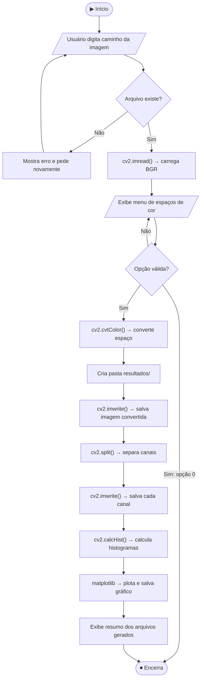

# 🖼️ Processamento de Imagens — Conversão de Espaços de Cor

> **Disciplina:** Visão Computacional  
> **Linguagem:** Python 3.13  
> **Principais bibliotecas:** OpenCV (`cv2`), Matplotlib, NumPy

---

## 📋 Índice

1. [Descrição do Projeto](#-descrição-do-projeto)
2. [Estrutura de Arquivos](#-estrutura-de-arquivos)
3. [Pré-requisitos](#-pré-requisitos)
4. [Instalação e Configuração](#-instalação-e-configuração)
5. [Como Executar](#-como-executar)
6. [Espaços de Cor Disponíveis](#-espaços-de-cor-disponíveis)
7. [Fluxo de Execução Detalhado](#-fluxo-de-execução-detalhado)
8. [Funções Principais](#-funções-principais)
9. [Arquivos Gerados](#-arquivos-gerados)
10. [Conceitos de Visão Computacional](#-conceitos-de-visão-computacional)
11. [Referências](#-referências)

---

## 📌 Descrição do Projeto

Este script realiza o **processamento de imagens** a partir de um arquivo escolhido pelo usuário, aplicando as seguintes operações:

| Etapa | Operação | Função OpenCV |
|-------|----------|---------------|
| 1 | Leitura da imagem do disco | `cv2.imread()` |
| 2 | Conversão para um novo espaço de cor | `cv2.cvtColor()` |
| 3 | Separação dos canais individuais | `cv2.split()` |
| 4 | Cálculo do histograma de cada canal | `cv2.calcHist()` |
| 5 | Salvamento de todas as imagens geradas | `cv2.imwrite()` |

O objetivo pedagógico é demonstrar na prática como diferentes **espaços de cor** representam a mesma imagem de maneiras distintas, e como analisar a **distribuição de pixels** por meio de histogramas.

---

## 📁 Estrutura de Arquivos

```
ProcessamentoDeImagens/
│
├── processamento_imagem.py   # Script principal
├── requirements.txt          # Dependências do projeto
├── README.md                 # Esta documentação
│
├── venv/                     # Ambiente virtual Python (gerado localmente)
│
└── resultados/               # Pasta criada automaticamente pela execução
    ├── <nome>_<ESPACO>_convertida.png      # Imagem no espaço convertido
    ├── <nome>_<ESPACO>_canal_1.png         # Canal 1 isolado (ex.: H do HSV)
    ├── <nome>_<ESPACO>_canal_2.png         # Canal 2 isolado (ex.: S do HSV)
    ├── <nome>_<ESPACO>_canal_3.png         # Canal 3 isolado (ex.: V do HSV)
    └── <nome>_<ESPACO>_histogramas.png     # Gráfico com os histogramas
```

> **Nota:** A pasta `resultados/` é criada automaticamente no mesmo diretório da imagem de entrada.

---

## ⚙️ Pré-requisitos

- **Python 3.13** ou superior
- **pip** (gerenciador de pacotes)
- **Sistema Operacional:** Windows, Linux ou macOS

---

## 🚀 Instalação e Configuração

### 1. Clone ou baixe o projeto

```powershell
cd C:\Users\Franciney\Desktop\ProcessamentoDeImagens
```

### 2. Crie o ambiente virtual

```powershell
python -m venv venv
```

### 3. Ative o ambiente virtual

**Windows (PowerShell):**
```powershell
.\venv\Scripts\Activate.ps1
```

**Windows (CMD):**
```cmd
.\venv\Scripts\activate.bat
```

**Linux / macOS:**
```bash
source venv/bin/activate
```

### 4. Instale as dependências

```powershell
pip install -r requirements.txt
```

> As dependências instaladas são:
> | Pacote | Versão | Finalidade |
> |--------|--------|------------|
> | `opencv-python` | 4.13.0 | Processamento de imagens |
> | `matplotlib` | 3.10.8 | Plotagem de histogramas |
> | `numpy` | 2.4.4 | Operações numéricas e arrays |

---

## ▶️ Como Executar

Com o ambiente virtual ativado, você pode executar os diferentes scripts do projeto. 
Se o venv já estiver ativado no terminal, use o comando `python <nome_do_script.py>`. 
Caso contrário, no Windows, você pode rodar apontando para o Python do venv: `.\venv\Scripts\python <nome_do_script.py>`.

Abaixo estão os comandos e descrições para executar cada um dos scripts do repositório:

### 1. Processamento de Imagens
Script que realiza a conversão de espaços de cor e análise de histogramas.
```powershell
python processamento_imagem.py
```

### 2. Contagem de Galinhas
Pipeline de Visão Computacional para identificar e contar galinhas em imagens (utiliza Watershed e Distance Transform).
```powershell
python contar_galinhas.py
```

### 3. Identificação de Bolinhas
Pipeline para detectar e contar objetos esféricos/circulares utilizando a Transformada de Hough.
```powershell
python identificar_bolinhas.py
```

### 4. Rastreamento (Humano vs Robô)
Sistema de rastreamento em vídeo utilizando YOLOv8, YOLO-Pose e ByteTrack.
```powershell
python track_robot_human.py
```

### 5. Pipeline de Filtros
Executa um pipeline de filtros e processamentos de imagem em tempo real.
```powershell
python pipeline_filtros.py
```

### 6. Eventos de Mouse e Trackbar
Script interativo para demonstrar o uso de eventos de mouse e trackbars no OpenCV.
```powershell
python mouse_trackbar.py
```

### Exemplo de sessão interativa (`processamento_imagem.py`)

```
════════════════════════════════════════════════════════════
  PROCESSAMENTO DE IMAGENS — VISÃO COMPUTACIONAL
════════════════════════════════════════════════════════════

  Digite o caminho completo da imagem: C:\imagens\foto.jpg

  ✅ Imagem carregada com sucesso!
     Dimensões : (480, 640, 3)  (altura × largura × canais)
     Tipo      : uint8

════════════════════════════════════════════════════════════
  MENU - ESCOLHA O ESPAÇO DE COR
════════════════════════════════════════════════════════════
  [1] HSV  (Matiz, Saturação, Valor)
  [2] YCrCb (Luminância + Crominância)
  [3] GRAY (Escala de Cinza)
  [4] Lab  (Luminosidade + a* + b*)
  [5] HLS  (Matiz, Luminosidade, Saturação)
  [6] XYZ  (CIE XYZ)
  [7] Luv  (CIE L*u*v*)
  [0] Sair

  Digite o número da opção desejada: 1
```

> **Dica:** No Windows, você pode arrastar o arquivo de imagem direto para o terminal para obter o caminho completo automaticamente.

---

## 🎨 Espaços de Cor Disponíveis

### `[1]` HSV — Matiz, Saturação, Valor

| Canal | Nome | Descrição |
|-------|------|-----------|
| H | Hue (Matiz) | Ângulo de cor no círculo cromático (0°–360°) |
| S | Saturation (Saturação) | Pureza/intensidade da cor (0 = cinza; 255 = cor pura) |
| V | Value (Valor) | Brilho da cor (0 = preto; 255 = máximo brilho) |

> **Aplicação:** Segmentação de cores, detecção de objetos por cor, rastreamento visual.

---

### `[2]` YCrCb — Luminância e Crominância

| Canal | Nome | Descrição |
|-------|------|-----------|
| Y | Luminância | Informação de brilho (componente principal da visão humana) |
| Cr | Crominância Vermelha | Diferença entre vermelho e luminância |
| Cb | Crominância Azul | Diferença entre azul e luminância |

> **Aplicação:** Compressão de vídeo (JPEG, MPEG), detecção de pele humana.

---

### `[3]` GRAY — Escala de Cinza

| Canal | Nome | Descrição |
|-------|------|-----------|
| GRAY | Intensidade | Valor único de 0 (preto) a 255 (branco) |

> **Fórmula:** `GRAY = 0.114·B + 0.587·G + 0.299·R`  
> **Aplicação:** OCR, detecção de bordas (Canny, Sobel), limiarização (Otsu).

---

### `[4]` Lab — CIE L\*a\*b\*

| Canal | Nome | Descrição |
|-------|------|-----------|
| L* | Luminosidade | 0 (preto absoluto) a 100 (branco absoluto) |
| a* | Eixo Verde–Vermelho | Negativo = verde; Positivo = vermelho |
| b* | Eixo Azul–Amarelo | Negativo = azul; Positivo = amarelo |

> **Aplicação:** Comparação perceptual de cores, correção de cor, análise de qualidade visual.

---

### `[5]` HLS — Matiz, Luminosidade, Saturação

| Canal | Nome | Descrição |
|-------|------|-----------|
| H | Hue (Matiz) | Ângulo da cor (0–180 no OpenCV) |
| L | Lightness (Luminosidade) | Quantidade de luz (0 = preto; 255 = branco) |
| S | Saturation (Saturação) | Vivacidade da cor |

> **Aplicação:** Filtros fotográficos, ajuste de iluminação em imagens.

---

### `[6]` XYZ — CIE XYZ

| Canal | Nome | Descrição |
|-------|------|-----------|
| X | — | Mistura de resposta dos cones de cor |
| Y | — | Luminosidade (corresponde à percepção humana) |
| Z | — | Quasi-igual ao canal azul |

> **Aplicação:** Base para conversão entre outros espaços de cor (Lab, Luv). Referência colorimétrica padrão.

---

### `[7]` Luv — CIE L\*u\*v\*

| Canal | Nome | Descrição |
|-------|------|-----------|
| L* | Luminosidade | Perceptualmente uniforme |
| u* | Crominância | Eixo vermelho–verde |
| v* | Crominância | Eixo azul–amarelo |

> **Aplicação:** Medição de diferenças de cor perceptualmente uniformes (ΔE).

---

## 🔄 Fluxo de Execução Detalhado



---

## 🧩 Funções Principais

### `carregar_imagem(caminho)`
Carrega a imagem com `cv2.imread` e valida a existência do arquivo.  
Levanta `FileNotFoundError` ou `ValueError` em caso de falha.

```python
imagem_bgr = carregar_imagem("C:/imagens/foto.jpg")
# retorna: np.ndarray com shape (H, W, 3) e dtype uint8
```

---

### `converter_imagem(imagem_bgr, config)`
Aplica `cv2.cvtColor` usando o código de conversão definido no dicionário `ESPACOS_DE_COR`.

```python
# Exemplo: conversão para HSV
imagem_hsv = cv2.cvtColor(imagem_bgr, cv2.COLOR_BGR2HSV)
```

---

### `separar_e_salvar_canais(imagem_convertida, config, ...)`
Usa `cv2.split` para decompor a imagem nos canais individuais e salva cada um como PNG.

```python
canais = cv2.split(imagem_hsv)
# canais[0] → H | canais[1] → S | canais[2] → V
```

---

### `calcular_e_salvar_histogramas(canais, config, ...)`
Para **cada canal**, chama `cv2.calcHist` e gera um gráfico com matplotlib.

```python
hist = cv2.calcHist(
    images   = [canal],
    channels = [0],
    mask     = None,
    histSize = [256],
    ranges   = [0, 256],
)
```

> - `histSize = [256]` → 256 bins (um por nível de intensidade)  
> - `ranges = [0, 256]` → faixa de valores analisada  
> - `mask = None` → analisa a imagem inteira (sem região de interesse)

---

## 📂 Arquivos Gerados

Após a execução, uma pasta `resultados/` é criada com os seguintes arquivos:

```
resultados/
├── foto_HSV_convertida.png      ← imagem completa no espaço HSV
├── foto_HSV_canal_1.png         ← canal H (Matiz) isolado
├── foto_HSV_canal_2.png         ← canal S (Saturação) isolado
├── foto_HSV_canal_3.png         ← canal V (Valor) isolado
└── foto_HSV_histogramas.png     ← gráfico com os 3 histogramas
```

> O prefixo `foto` corresponde ao nome do arquivo de imagem original (sem extensão).  
> `HSV` é substituído pelo espaço de cor escolhido (ex.: `GRAY`, `Lab`, `YCrCb`).

---

## 📚 Conceitos de Visão Computacional

### O que é um Espaço de Cor?
Um **espaço de cor** é um modelo matemático que descreve como as cores são representadas numericamente. Diferentes espaços organizam as informações de cor de formas distintas:

- **BGR/RGB** → modelo aditivo de luz (padrão de monitores)
- **HSV/HLS** → model intuitivo baseado em percepção humana
- **YCrCb** → separa luminância de crominância (útil em compressão)
- **Lab/Luv** → perceptualmente uniformes (ΔE representa diferença real percebida)
- **XYZ** → espaço de referência colorimétrico internacional (CIE 1931)

### Por que `cv2.imread` carrega em BGR e não RGB?
O OpenCV usa o padrão **BGR** (Blue-Green-Red) por razões históricas de hardware. Ao exibir ou salvar, o OpenCV interpreta os canais nessa ordem. Para converter para RGB (necessário em matplotlib), use:

```python
imagem_rgb = cv2.cvtColor(imagem_bgr, cv2.COLOR_BGR2RGB)
```

### O que é um Histograma de Imagem?
O histograma mostra a **distribuição de intensidades** dos pixels de um canal:
- Eixo X → nível de intensidade (0 a 255)
- Eixo Y → número de pixels com aquela intensidade

Um histograma concentrado à esquerda indica imagem **escura**; à direita, imagem **clara**; distribuído uniformemente indica **bom contraste**.

---

## 📖 Referências

- [OpenCV Documentation — Color Space Conversions](https://docs.opencv.org/4.x/d8/d01/group__imgproc__color__conversions.html)
- [OpenCV `cv2.calcHist` Reference](https://docs.opencv.org/4.x/d6/dc7/group__imgproc__hist.html)
- [Matplotlib Documentation](https://matplotlib.org/stable/index.html)
- [CIE Colorimetry — Wikipedia](https://en.wikipedia.org/wiki/CIE_1931_color_space)
- Bradski, G. & Kaehler, A. **Learning OpenCV 3**. O'Reilly Media, 2016.

---

*Documentação gerada para fins acadêmicos — Visão Computacional*
